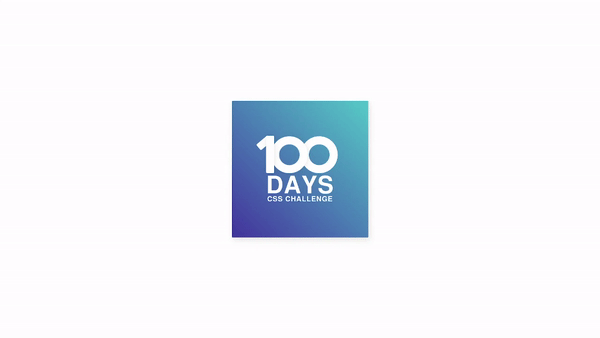
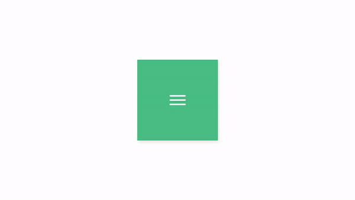

# CSS Projects

This repository contains many CSS projects to practice and learn. Each project
has its goal, for example, some projects focus on practicing CSS animations with
JavaScript

---

## Summary

- [Project 1 - 100 Days Challenge](#project-1---100-days-challenge)
- [Project 2 - Hamburger Menu](#project-2---hamburger-menu)

---

## Project 1 - 100 Days Challenge

### What I learned

- z-index

### CSS Properties Used

- position
- display
- z-index

### Demonstration



---

## Project 2 - Hamburger Menu

### What I learned

- animation
- translate
- keyframes

### CSS Properties

- animation
- translate
- keyframes

### Demonstration



---

## How to use this repository

1. Clone the repository:
   ```bash
   git clone https://github.com/DaniloSreis/css-projects.git
   ```
